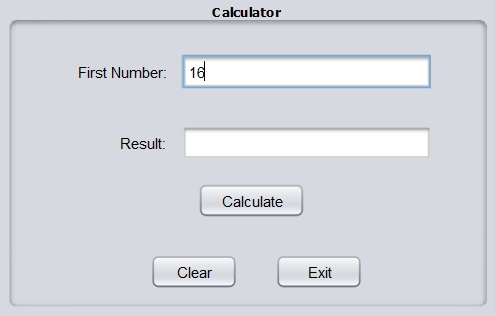
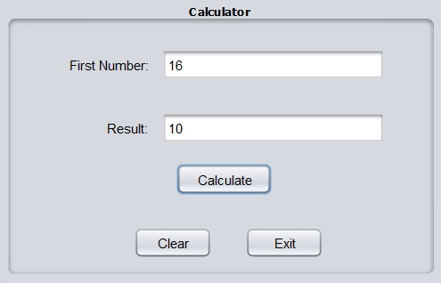

# Project Title
From Int to Hex

## Description
This application, developed using Java Swing, allows a user to input an Integer number and then it calculates the equivalent Hexadecimal number.

## Java version
- The project is using Java Development Kit (JDK) version 16

### Installing and Running
- Simply download the FromIntToHex.jar file and run it

## Contact
- Full name: Manuele Tacchetti
- Email: manuele.tacchetti@gmail.com

# Screenshots

- Input

- Result

